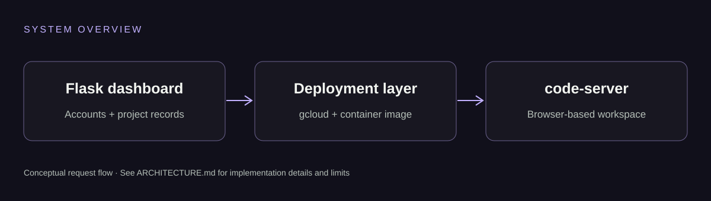

# Architecture

## Components
- `app/__init__.py`: Flask factory, SQLAlchemy and login-manager setup.
- `app/auth/`: forms and account registration/login.
- `app/models.py`: user and project records in SQLite.
- `app/main/routes.py`: dashboard, project views and gcloud deployment route.
- `docker/`: code-server image and repository startup script.
- `app/Gcloud/gcloud.py`: older Cloud Run helper; not imported by the main Flask factory.

## Intended flow
A user selects a GitHub repository in the dashboard. A configured cloud integration deploys a code-server image with that repository. The dashboard records the returned service URL. This is a prototype integration, not a verified production deployment pipeline.

## Security and persistence boundaries
The existing deployment code builds shell commands from input, and some routes need stronger authentication/ownership enforcement. The container disables editor authentication. Cloud Run filesystems are ephemeral, so this checkout does not guarantee durable workspace changes.

Treat the Flask dashboard as the control plane and the editor container as a separate execution environment. Production use requires input validation, argument-list subprocess execution, strict authorization, CSRF protection, private services and an explicit storage model.

## Scope
The GitHub Pages site is a static, read-only project presentation. It does not run Flask, invoke gcloud, accept repository submissions or allocate cloud resources.
