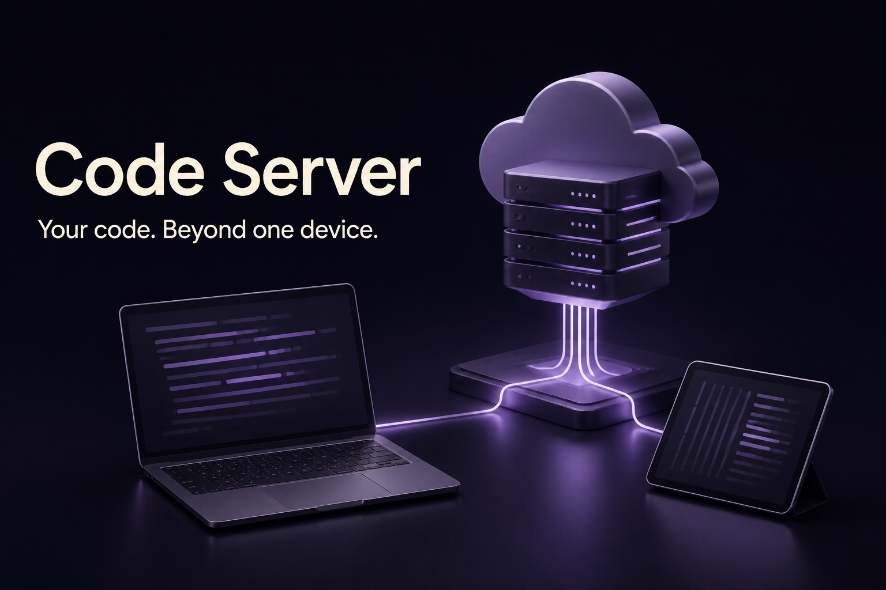

# Code Server

[](https://mayank-vekariya.github.io/my-ide-cloud/)

**[Explore the showcase](https://mayank-vekariya.github.io/my-ide-cloud/)** · [Local setup](LOCAL_SETUP.md) · [Architecture](ARCHITECTURE.md) · [Deployment](DEPLOYMENT.md)

A Flask dashboard and containerized code-server prototype for browser-based development. It connects user/project records, GitHub repository input and a Google Cloud Run deployment path.

## What is implemented

- Registration, login and per-user project listings backed by Flask-SQLAlchemy.
- A Docker definition and startup script for the upstream code-server editor.
- A gcloud-based deployment prototype.
- Static showcase publishing is independent of the application and creates no cloud resources.

## System overview


## Quick start

Read [LOCAL_SETUP.md](LOCAL_SETUP.md) for dependencies and runtime limits before starting the application. To preview only the static project page, from the repository root:

```sh
python -m http.server 4173 --bind 127.0.0.1 --directory docs
```

Open http://127.0.0.1:4173. This preview has no backend and uses no credentials.

## Repository guide

- [LOCAL_SETUP.md](LOCAL_SETUP.md): installation, local commands and troubleshooting.
- [ARCHITECTURE.md](ARCHITECTURE.md): source mapping, request flow and tradeoffs.
- [DEPLOYMENT.md](DEPLOYMENT.md): Pages setup and application-hosting boundaries.
- `docs/`: dependency-free HTML, CSS, JavaScript and images.
- `scripts/check_showcase.py`: static-page checks; run with Python before publishing.

## Status and limitations

This is a local/academic prototype. The existing deployment path requires security hardening before public use, including authenticated workspaces, safe command execution, authorization and CSRF protection. No cloud resources are created by this showcase.

The banner is AI-generated conceptual artwork, not an application screenshot or measured model output. The architecture diagram is an implementation-oriented schematic. No benchmark, scale or uptime claims are implied.

## Credits and attribution

Project contributors: **Mayank Vekariya**, **Dileep Varma Rudraraju**, and **Ali Rayyan Mohammed**. Browser editor: [Coder code-server](https://github.com/coder/code-server). The prior README's missing license-file link is not a verified license grant; check repository history and obtain contributor agreement before redistribution.

